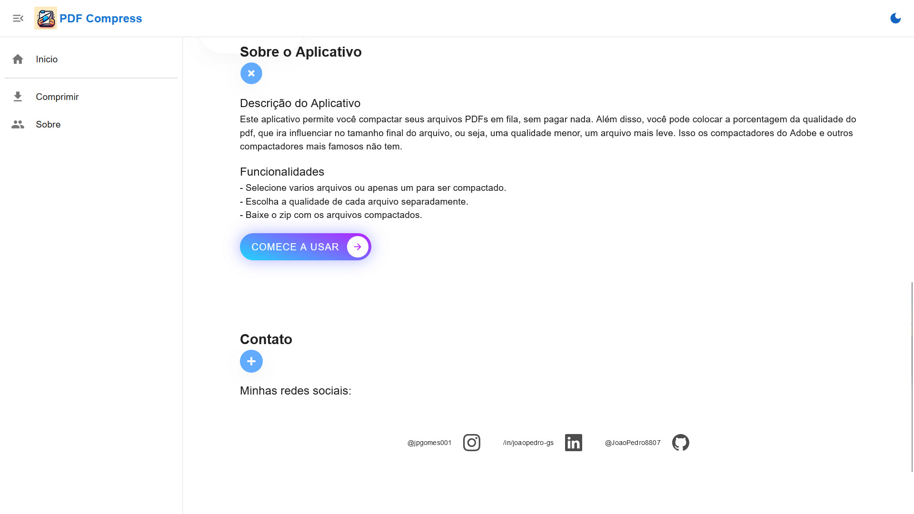
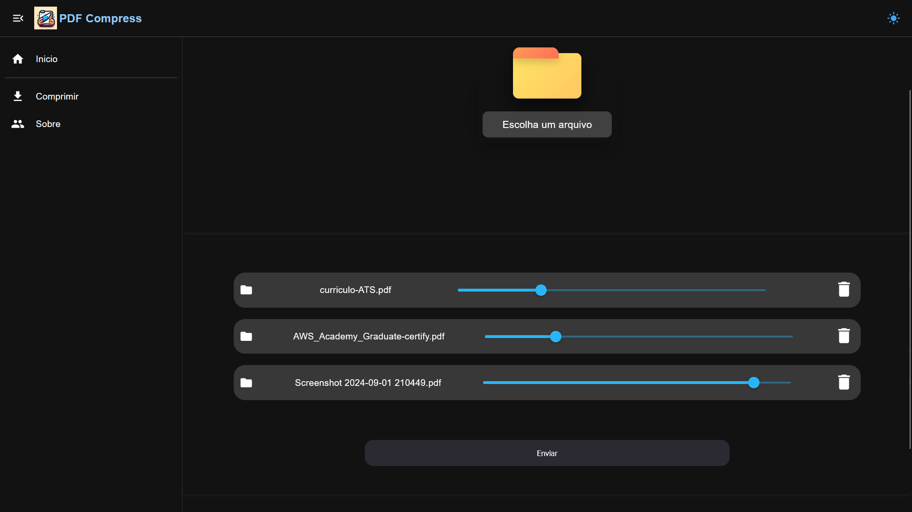
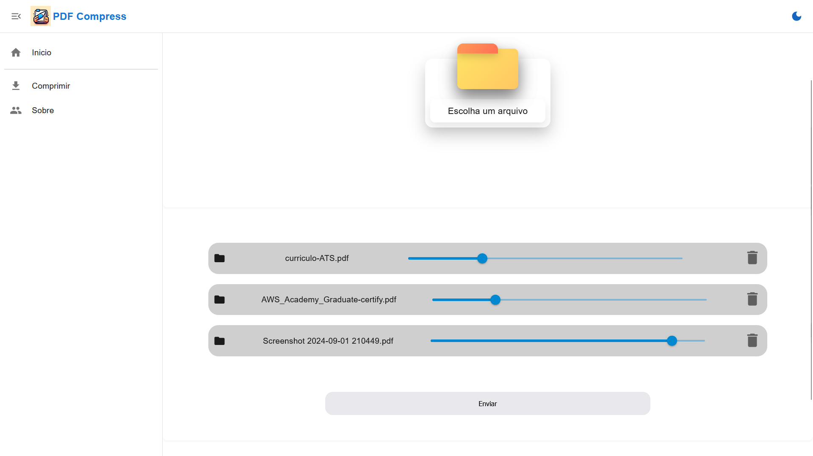
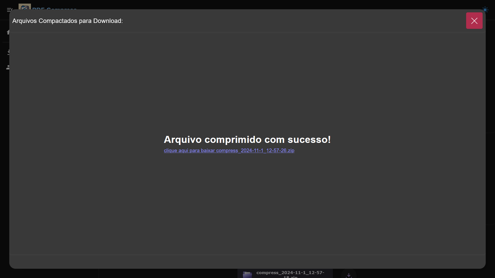

### PDF Compress

Recentemente eu tive que ajudar meu pai a enviar alguns comprovantes o trabalho dele, porém na plataforma só aceitava arquivos PDF com menos de 100kb, então fui procurar algum compactador que pudesse comprimir varios arquivos.

O que parecia uma coisa fácil e simples só dava dor de cabeça. Primeiramente tentei o Adobe, porém para compactar vários arquivos em fila é necessário assinatura. Então tentei o IlovepDF, nele essa funcionalidade é grátis, porém não conseguia comprimir para menos de 100kb. Pesquisei outros, porém nenhum serviu.

Como nenhum deles resolvia 100% meu problema, eu decidi fazer eu mesmo. Dei uma pesquisa sobre, e descobri uma biblioteca em Python que permite a fácil manipulação de arquivos (inclusive pdf). Então rápidamente fiz um script que lê os arquivos pdfs na minha pasta e salva em outra, resolvendo o problema. Mas para facilidade e aprendizado, aprimorei o script e implementei uma interface web para deixar tudo mais fácil para qualquer pessoa utilizar.

Como há a possibilidade do usuário enviar vários arquivos, resolvi implementar async views, para que eu pudesse deixar a compressão em corrotinas e assim, poder responder com os arquivos compactados mais rápido pro cliet, para isso utilizei o eventLoop asyncio e o asgiref que consegue dar suporte para as views async do Django.

Ao enviar os arquivos e suas respectivas qualidades, a view do django captura os arquivos e qualides separados para depois fazer um zip dos dados. Logo após, faço o load do arquivo em memória com o BitysIO e mando para o compactador que utiliza o AsposeWords. 

O comptactador pega o arquivo em memória e consegue dividir o pdf por imagens, e nessas imagens, consigo iterar e editar alguns parâmetros, como margens, qualidade, largura e altura. E para corrotina, eu passo uma instancia de um arquivo Zip em memória para que ao salvar, sobrescreva o mesmo arquivo.

Então retorno como resposta o arquivo zipado, onde consigo baixa-lo no client com o Blob Object. 

